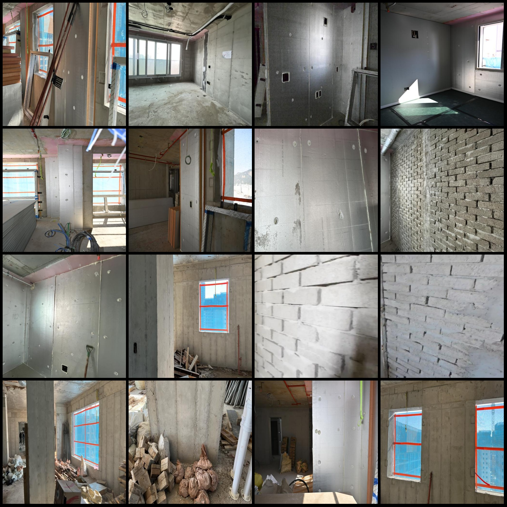
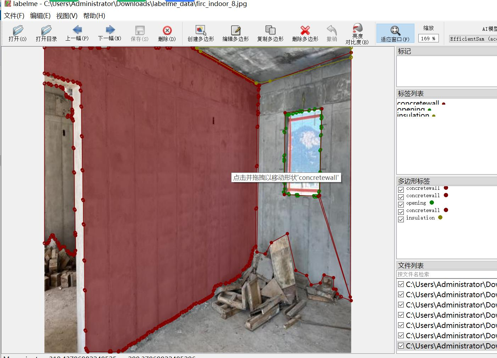

# Smart Building Indoor House Structure Identification and Segmentation Dataset (LabelMe format, 2111 images, 5 categories)

The dataset is in the labelme format (without a mask file, only containing JPG images and their corresponding JSON files). The number of images (JPG file count) is 2111. The number of annotations (JSON file count) is also 2111. There are 5 types of annotations: ["concretewall", "opening", "masonrywall", "insulation", "plasterboard"].

Each category has an annotation count:
- Concrete wall : 8518
- Opening : 2127
- Masonry wall : 981
- Insulation : 1901
- Plasterboard : 1477
Total box count: 15004

Annotation tool used: labelme=5.5.0
Image resolution: 512x512
Annotation rule: Polygons are drawn around the categories for each image.

Important Notice: This dataset can be edited using the labelme tool. JSON datasets need to be converted into mask or yolo format or coco format for semantic segmentation or instance segmentation.
Special Disclaimer: This dataset does not guarantee the accuracy of the trained models or the weight files.

Image previews:
Annotation example:
Original image (randomly selected 16 images):
Annotation drawing results:
LabelMe editing example:
## Image

Here is a pay link on Stripe ( https://buy.stripe.com/3cs8yP7sY87d0vu9AB ). Please contact me lonlonago@foxmail.com after funding $89, and I will send you a complete data files , thank you!

